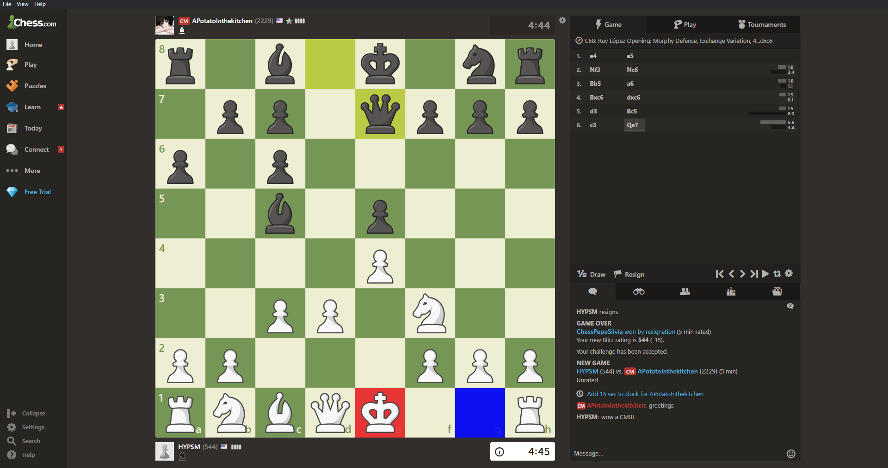

# Chesstool
Chesstool is an opensource desktop chess application that calculates the best possible moves you can make in a game of online chess. Currently, it only supports [chess.com](https://chess.com/); however I will be adding features (i.e. an intuitive UI) and additional sites like [lichess.org](https://lichess.org/) and [chess24.com](https://chess24.com/). It is currently rated at 3438 ELO.

## Disclaimer
I am in no way responsible for the misuse of this program or advocating for unfair advantages. Using such a program in ranked chess play is unethical and will result in sanctions on your chess account. This project is not meant to aid cheaters but rather a way to educate chess players and to provide detailed in-game analysis. Please use this responsibly. (i.e. both parties must be aware of the tool being used in an unrated game)

## About
Chesstool came about as a fun project to pursue to help me overcome my programming burnout. By combining my love for chess and devotion to programming I was able to create an application that utilizes the [Stockfish Chess AI](https://github.com/official-stockfish/Stockfish). My interest stems from the ingenious idea of marking chess pieces on the board which I discovered from [ChessBotX](https://chess-bot.com/). However, unlike ChessBotX, this tool is FREE and is meant primarily for education. The decision to opensource this project instead of putting it behind a paywall comes from my belief that the sharing of code -- no matter how insignificant -- serves to benefit society. I hope you will enjoy this project as much as I do!

## Setup
1. Clone the repository
2. Install the necessary dependencies through yarn
3. Run the command `npm run start`

## How it works
Chesstool was created so that users would not have to download a separate program to play chess on a browser. Instead, this entire application is the browser and tool combined. The Chesstool consists of two parts.

1. [Electron](https://github.com/electron/electron)
2. Stockfish Chess Engine

Utilizing Electron's Chromium wrapper, the target website is loaded into a browserwindow. Next, Javascript is injected into the page which provides a bridge between the chessboard and Stockfish. Simultaneously, a node express server is created for Stockfish. Once the server is created and the user starts a game, the Javascript sends eventEmitter requests to and from the Stockfish engine, which results in the board being changed. The red color highlights the piece that should be moved while the blue color highlights where the piece should be moved to. This is quite similar to chess.com's own highlight system.

## What does it look like?

