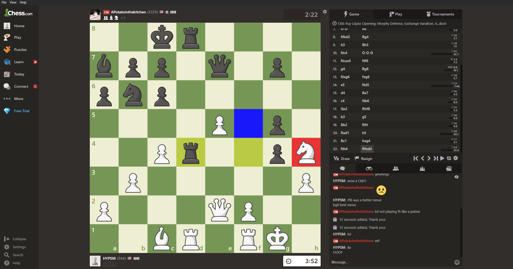
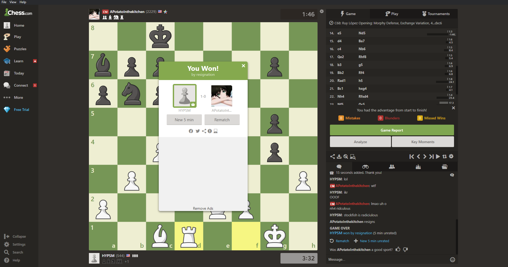
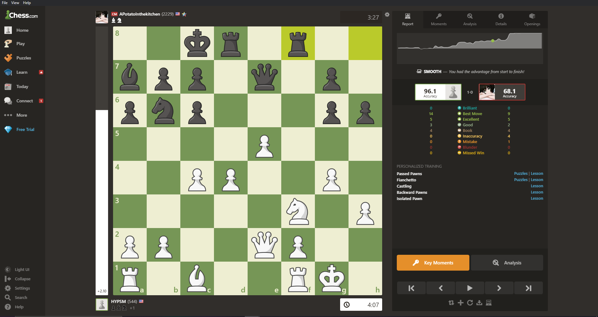

# Chesstool
Chesstool is an opensource desktop chess application that calculates the best possible moves you can make in a game of online chess. Currently, it only supports [chess.com](https://chess.com/); however I will be adding features (i.e. an intuitive UI) and additional sites like [lichess.org](https://lichess.org/) and [chess24.com](https://chess24.com/). It is currently rated at 3438 ELO.

### Chesstool in action


### Features:
1. Best move calculator
2. Opponent move prediction
3. Cheat Detector (In-progress)
4. Advertisement Removal

## Disclaimer
I am in no way responsible for the misuse of this program or advocating for unfair advantages. Using such a program in ranked chess play is unethical and will result in sanctions on your chess account. This project is not meant to aid cheaters but rather a way to educate chess players and to provide detailed in-game analysis. Please use this responsibly. (i.e. both parties must be aware of the tool being used in an unrated game)

As per [Chess.com's rules](https://support.chess.com/article/317-what-counts-as-cheating-on-chess-com), you can only use this tool in unrated chess. Don't abuse it!

## About
Chesstool came about as a fun project to pursue to help me overcome my programming burnout. By combining my love for chess and devotion to programming I was able to create an application that utilizes the [Stockfish Chess AI](https://github.com/official-stockfish/Stockfish). My interest stems from the ingenious idea of marking chess pieces on the board which I discovered from [ChessBotX](https://chess-bot.com/). However, unlike ChessBotX, this tool is FREE and is primarily meant for education. The decision to opensource this project instead of putting it behind a paywall comes from my belief that the sharing of code -- no matter how insignificant -- serves to benefit society. I hope you will enjoy this project as much as I do!

## Setup
1. Clone the repository
2. Install the necessary dependencies through yarn
3. Run the command `npm run start`

## How it works
Chesstool was created so that users would not have to download a separate program to play chess on a browser. Instead, this entire application is the browser and tool combined. The Chesstool consists of two parts.

1. [Electron](https://github.com/electron/electron)
2. [Stockfish Chess Engine](https://github.com/official-stockfish/Stockfish)

Utilizing Electron's Chromium wrapper, the target website is loaded into a browserwindow. Next, Javascript is injected into the page which provides a bridge between the chessboard and Stockfish. Simultaneously, a node express server is created for Stockfish. Once the server is created and the user starts a game, the Javascript sends eventEmitter requests to and from the Stockfish engine, which results in the board being changed. The red color highlights the piece that should be moved while the blue color highlights where the piece should be moved to. This is quite similar to chess.com's own highlight system.

## What does it look like?
**All games were played in unrated chess against my friend [Pratik](https://github.com/pratikplayer), who just so happens to be a highly talented Candidate Master (CM).**
### A. Castling King side

#### Chesstool will account for awkward moves like Castling, Promoting, and En passant
### B. Forking Queen and Rook

#### Chesstool understands the best moves to make. In this case, forking the Queen and Rook pretty much won the game.
### C. Winning against a CM

#### Thanks to Chesstool, I was able to beat an extremely talented chess player - something that I wouldn't have been able to pull off without it.
### D. 96.1% accuracy against a CM

#### As you can see, with the Chesstool rated at 3438 ELO, even a professional player rated at 2229 ELO doesn't stand a chance.

### Game Analysis
For those who want to analyze the game we played, visit [https://www.chess.com/analysis](https://www.chess.com/analysis) and paste the pgn from below into the Load PGN section.

```
1. e4 e5 2. Nf3 Nc6 3. Bb5 a6 4. Bxc6 dxc6 5. d3 Bc5 6. c3 Qe7 7. O-O h6 8. Nbd2
Bg4 9. h3 Bh5 10. Nc4 O-O-O 11. Ncxe5 Nf6 12. g4 Bg6 13. Nxg6 fxg6 14. e5 Nd5
15. d4 Ba7 16. c4 Nb6 17. Qe2 Rhf8 18. b3 g5 19. Bb2 Rf4 20. Rad1 h5 21. Bc1
hxg4 22. Nh4 Rfxd4 23. Nf5 Qc5 24. Nxd4 Rxd4 25. Rxd4 Qxd4 26. Rd1 1-0
```

## Reflections
Special thanks to [Pratik](https://github.com/pratikplayer) for being my Guinea pig for this project. You can find his FIDE profile [here](https://ratings.fide.com/profile/30920450). Also, in case you're reading this Danny Rensch, I'm open for a job ;).
